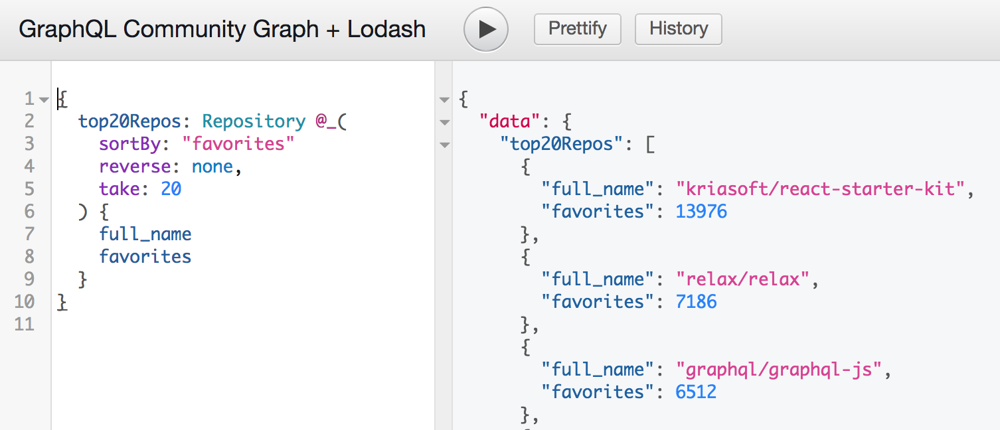

# Community GraphQL Lodash

This is [GraphQL Community graph](https://github.com/neo4j-graphql/graphql-community) proxy powered with [GraphQL Lodash](https://github.com/apis-guru/graphql-lodash).

## [Try it out!](http://graphql-community.apis.guru/)

More examples [here](https://gist.github.com/IvanGoncharov/00fcbac3f5da71f5f39e897428e47a28).
For more news follow us on [Twitter](https://twitter.com/APIs_guru)
